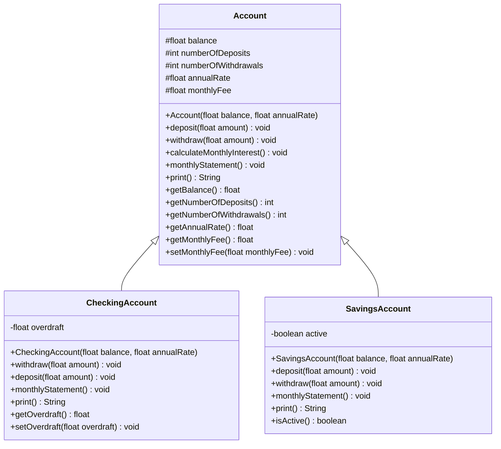
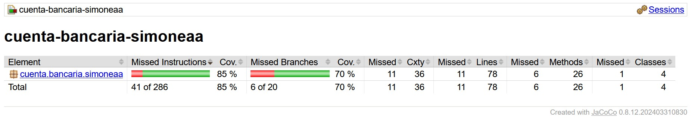

# project-java-cuenta-bancaria-simoneaa

## Descripción

Desarrollar un programa que modele una cuenta bancaria que tiene los siguientes atributos, que deben ser de acceso protegido:

- Saldo/Balance (float)
- Consignaciones/Deposits, con valor inicial 0 (int)
- Retiros/Withdrawals, con valor inicial 0 (int)
- Tasa anual/AnnualRate, porcentaje (float)
- Comisión mensual/MonthlyFee, con valor inicial 0 (float)  

La clase Account inicializa los atributos necesarios (balance y monthlyFee), y cuenta con los siguientes métodos:

- Consignar dinero y actualizar el saldo
- Retirar dinero y actualizar el saldo, el valor no puede superar el saldo
- Calcular el interés mensual y actualizar el saldo
- Actualizar el saldo restando la comisión mensual y calculando el interes mensual
- Retornar los valores de los atributos

---

## Subclases

1. **Cuenta de ahorros/SavingsAccount**

Si el saldo es menor a 10.000, la cuenta está inactiva. Se redefinen los métodos siguientes:
- Consignar y retirar: Solo podrán invocarse si la cuenta esta activa
- Extracto mensual: Si los retiros superan 4, se cobran 1000 por cada retiro adicional, y al hacer el extracto se determina si está activa o no
- Imprimir: Retorna saldo, comisión y número de transacciones

2. **Cuenta corriente/CheckingAccount**

- Retirar: Puede superar el saldo pero el dinero debido se guarda en el sobregiro/overdraft
- Consignar: Si hay sobregiro, la cantidad lo reduce
- Imprimir: Retorna saldo, comisión, número de transacciones y sobregiro

---

## Diagramas UML de Clase

---

## Testing

